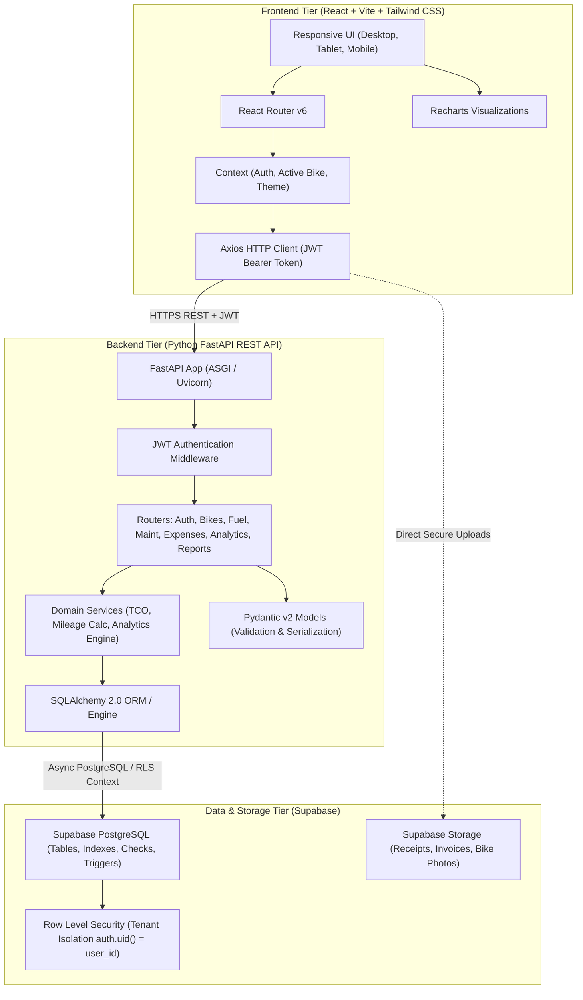
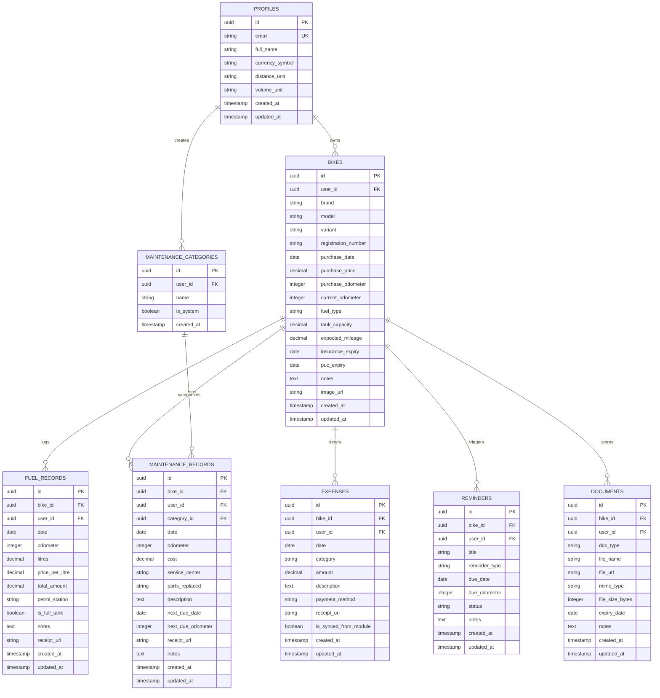

# BikeCare – Architecture & Technical Design Specification

## System Architecture

## Entity Relationship Model

## REST API Specification Summary

- **Auth**: `/api/v1/auth/register`, `/api/v1/auth/login`, `/api/v1/auth/me`, `/api/v1/auth/profile`
- **Bikes**: `/api/v1/bikes`, `/api/v1/bikes/{id}` (CRUD)
- **Fuel**: `/api/v1/bikes/{bike_id}/fuel` (Log refills, calculate mileage, fetch history)
- **Maintenance**: `/api/v1/bikes/{bike_id}/maintenance`, `/api/v1/maintenance/categories`
- **Expenses**: `/api/v1/bikes/{bike_id}/expenses` (Categorized non-fuel & general expenses)
- **Reminders**: `/api/v1/bikes/{bike_id}/reminders`, `/api/v1/reminders/{id}/complete`
- **Dashboard & Analytics**: `/api/v1/dashboard/{bike_id}`, `/api/v1/analytics/{bike_id}`, `/api/v1/tco/{bike_id}`
- **Reports**: `/api/v1/reports/{bike_id}`, `/api/v1/reports/{bike_id}/export/csv`
